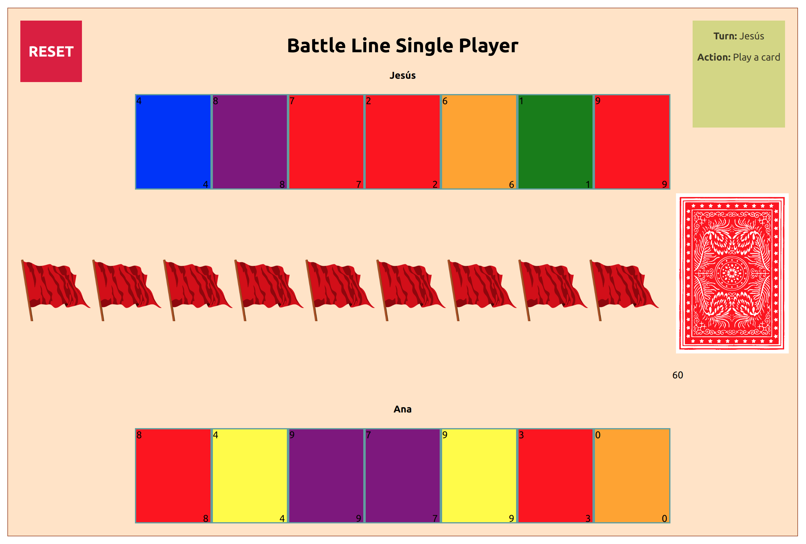

# BattleLineLike
Free and open source implementation of the board game Battle Line.




## How to run:

The only playable version right now is the single-player one:

``` 
cd client-single-player
npm start
```


## Rights:
All the rights of the game mechanics belong to the original designers of the board game.


